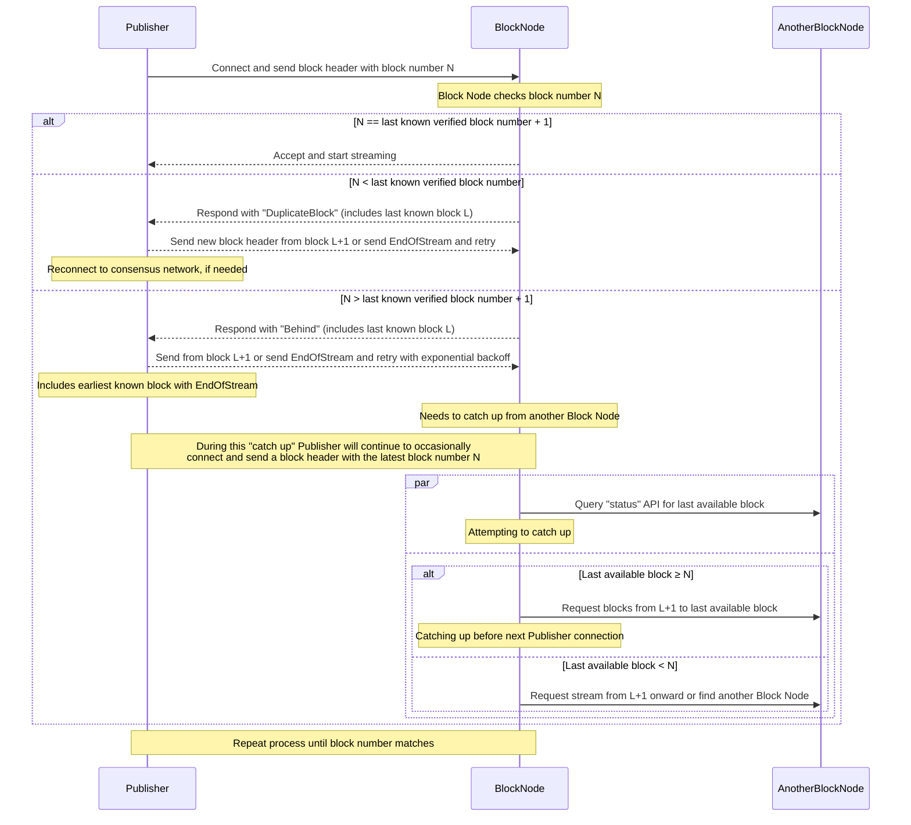
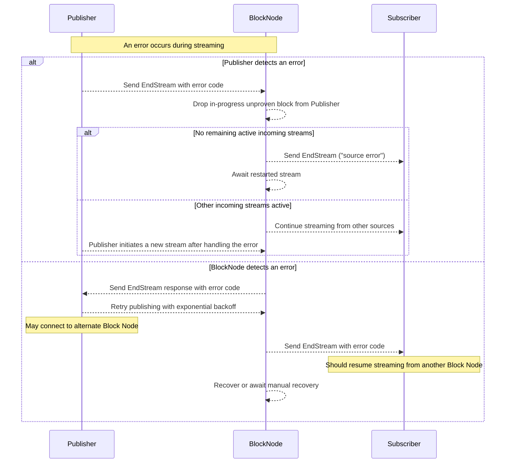

# Block Node Connect Protocol for `publishBlockStream`

## Table of Contents
1. [Abstract](#abstract)
   1. [Reliability note](#reliability-note)
1. [Definitions](#definitions)
1. [Base Protocol](#base-protocol)
   1. [Base Protocol Diagram](#base-protocol-diagram)
1. [Error Handling](#error-handling)
   1. [Error Handling Diagram](#error-handling-diagram)

## Abstract
This protocol describes how a Publisher and Block Node SHALL interact for
the `publishBlockStream` API. The protocol provides for either side of the
stream to signal an orderly end of the stream, for the block node to signal
that it has fallen behind the publisher, for the block node to signal that the
publisher has fallen behind the block node, and describes basic error
conditions. The protocol also includes specific provision for how both
publisher and block node will behave when a block node must spend time to
"catch up" to a publisher by requesting older blocks from another block node.
This protocol does not describe behavior related to the similar "pull" API
`subscribeBlockStream` or to the "catch up" process.

### Reliability note
This protocol is very careful about error conditions. A consensus node
publishing to a block node faces a hard requirement that if a block is not
validated and persisted within a short time, the consensus node must stop
processing entirely until it does have assurance that its blocks are
validated and persisted. This occurs because the block stream is the actual
"block chain" for the network, and if even one block is lost, then the chain
is broken; with disastrous consequences. Consensus nodes are one of the
core clients of this protocol as Publisher, so a core assumption of this
protocol is that if anything occurs to suggest to a publisher that a block
node might fail to store blocks permanently, the publisher should end the
stream and retry (either to another block node, or after a short delay).

## Definitions

<dl>
<dt>Block Node</dt>
<dd>A software system intended to store and process a Block Stream.  The API for
    a Block Node is defined in HIP 1056, among others.</dd>

<dt>Block Number</dt>
<dd>A monotonically increasing number assigned by consensus to each block produced
  by the network.</dd>

<dt>Publisher</dt>
<dd>An entity publishing blocks to a Block Node via the `publishBlockStream` API
  This is typically a Consensus Node or another Block Node.</dd>

<dt>Subscriber</dt>
<dd>An entity that subscribes to a verified or unverified Block Stream from a
  Block Node.</dd>

<dt>Verified Block</dt>
<dd>A verified block is a block for which a Block Proof is received and for which
  the TSS signature of the network ledger ID is valid.</dd>
</dl>

## Base Protocol
* Publisher, on connect, sends a block header, this contains a block number.
   * If this is the next block, no problem, start streaming.
   * If this is less than last known verified block, respond with
     "DuplicateBlock"
      * Response includes the last known block, so Publisher can perhaps do its
        own catch up or reconnect.
      * This REQUIRES Publisher to check and resend block header, or end the
        stream and restart.
      * This includes if Publisher sends a block less than the last known block,
        but this Block Node, for some reason, does not actually hold that
        earlier block.
         * In this case the Block Node _must_ retrieve the missing block(s) from
           another Block Node to fill the gaps, but SHALL always respond to
           Publisher with the very latest known and verified block. The
           streaming API is only for current data, not for filling gaps.
   * If this is greater than next block, this Block Node missed one or more
     blocks and is behind.
      * Respond with "Behind"
         * This includes the last known and verified block number.
         * Publisher will send from block after that block, or send
           `EndOfStream` and retry with exponential backoff.
         * Publisher will include earliest known block with end of stream, so
           this Block Node has an idea of the range to catch up.
            * This is _advisory_, and will almost certainly change before the
              Block Node can finish "catching up".
         * If Publisher retries before the Block Node is able to "catch up",
           the Block Node MUST record the offered block number, and continue
           trying to "catch up" to that. The response is still "Behind" with
           the last known block number.
            * This allows Publisher to jump in to "catch up" directly if
              the Block Node is behind, but close enough, by sending earlier
              block(s) instead of `EndOfStream`.
         * The Block Node will need a failure detection if the required target
           block doesn't get "closer" with each connection from Publisher.
      * If Publisher ends stream, the Block Node needs to catch up from another
        Block Node
         * Query a Block Node "status" API, to get the last available block.
            * If it is greater than or equal to the block number Publisher sent
               * Ask for a range, last-known-block+1 to last-available-block.
               * Hopefully catch up before next Publisher connection.
            * If it is less than the block number Publisher sent
               * Either ask for a stream last-known-block+1 to "infinite" and
                 quit when caught up OR ask another Block Node, in case all
                 needed blocks available elsewhere.
   * Each Publisher connect will send a block header, repeat above process until
     the Block Node gets a matched block number or Publisher can finish
     catching up that Block Node.
* > Note, a Block Node can (re)enter "catch up" _any_ time that Block Node gets
    the next block from Publisher with a block number that is not what the Block
    Node expects. This simplifies logic for working out when to retry or
    reset a stream.

### Base Protocol Diagram

## Error Handling
* If Publisher detects an error at any time
   * Next BlockItem will be an `EndStream` item with an appropriate error code.
   * Block Node will drop any in-progress unproven block from that Publisher,
     and, if no remaining active incoming streams, notify all Subscribers with
     an `EndStream` item specifying "source error".
   * Block Node will continue streaming from other incoming stream sources, if
     any, or await a restarted stream if no other incoming stream sources.
* If a Block Node detects an error at any time
   * Block Node will send an `EndStream` response to all incoming streams, with
     appropriate status code.
      * Publisher, on receiving the end stream, will retry publishing the
        stream; and will use exponential backoff if the Block Node failure
        continues.
         * If Publisher has multiple "downstream" Block Node options, a
           Publisher _may_ connect to an alternate Block Node for reliability
           and mark the failed Block Node as a backup.
   * Block Node will send `EndStream` to all Subscribers with appropriate
     status code.
      * Subscribers _should_ resume streaming from another Block Node
   * Block Node will either recover or await manual recovery.

### Error Handling Diagram

