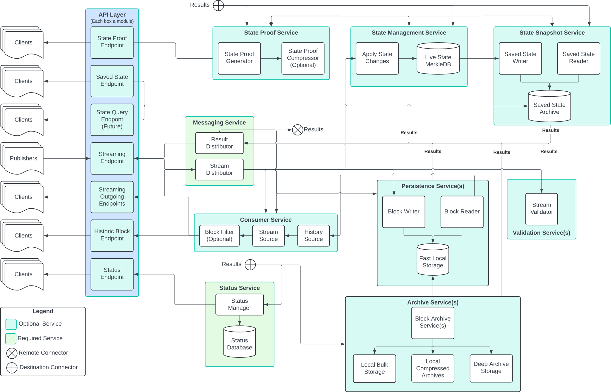

# Block Node Nano-Service Approach
## Abstract
To date, block node has been developed under pressure and with changing, incomplete, or inaccurate requirements.
As a result, the system is tightly interconnected, and suffers from a difficulty making changes to
one segment of the system without also impacting unrelated segments. To address this, and ensure
the Block Node is able to be extended, enhanced, and deployed in the manner required for all
current identified usage, a modified structure of the system is herein detailed.

## Revised Diagram

## Core Concepts
1. Helidon and API objects are restricted to the API layer.
   * The less we flow these externally defined interfaces and classes through
     the system, the more easily we can potentially make outward facing API
     changes without reworking the internal design.
1. Most services are not required to be present in every deployment of the block node.
1. No service should depend on classes or interfaces from another service.
   * That service might not be deployed, and each service should be removable
     without breaking other services.  The exception is the Messaging service.
   * To this end, services should be independent modules with clearly defined
     and carefully controlled interactions.
1. Two services are required for all deployments, Messaging and Status
   * Only Messaging should offer any internal API at all.
     * Basically, Messaging is where data and results are published (presumably
       via LMAX Disruptor instances) among other services.
     * The Status service is only required because it is specified as always
       present for a block node client to query via gRPC API.
     * The Messaging service should _not_ have any external (i.e. gRPC) API.
   * We must remain vigilant to avoid packing them with interfaces or extra classes.
   * These services should be as slim as possible, and interactions between
     services should be based on a very limited set of `Record` messages
     that are passed between services (blindly) by the Messaging service
     rather than interfaces or direct method calls.
1. There is an assumption in this approach that Messaging offers both "push"
   and "pull" options for receiving messages, and each service may choose the
   most appropriate interaction for that specific service.
   * A persistence service, for instance, might use "push" for simplicity and
     because it does not benefit from holding items within the Disruptor, but
     a streaming client service might use "pull" in order to allow each of
     many remote clients to be receiving data at slightly varying rates and
     more easily switch from live to historical and back if a particular
     client falls behind and later "catches up".
1. Most services both publish and observe the "results" messages
   * By listening for results, any service can react to changes in any other
     service, but also behave reasonably when another service does not exist.
   * Publishing a result (rather than calling an API) makes it easy for each
     service to focus entirely on its own function and not try to work out the
     highly complex possible interactions with all other possible services.
   * Some services (e.g. Archive service) won't make sense if _nothing_ publishes
     a particular result, but even then the service need not be concerned with
     the how/what/why of a result, and need only react if and when a result is
     encountered with the relevant type and content.
1. Most services will _also_ listen to the main data messages (List<BlockItem>)
   which is the primary data flowing through the system.
   * Note that Publisher service is also not required, so this flow of data might
     be empty, or might be produced from some other source.
   * There _might_ also be a stream of "historical" blocks used to serve client
     requests for those blocks.  This is still to be determined.
1. Configuration for a service is entirely restricted to that service, and does
   not determine what "version" of a service or whether a service is running.
   * It _might_ assist multiple loaded "versions" to identify a conflict.
1. The JVM `ServiceLoader` is used to load every service that is present, this
   may include multiple services of the same "type" (e.g. multiple archive
   services, multiple persistence services, etc...).
      * It is up to the particular services to ensure that either multiple
        different versions cooperate properly or an error is published on
        startup that multiple incompatible services are loaded. Generally it's
        cleanest if multiple services of the same type are able to work
        independently without issues.  If that isn't possible, a service-
        specific configuration is a good alternative.

## Expected Benefits
1. Services are decomposed to small units, often what is thought of as a single
   process is accomplished by multiple nano-services.  This makes each such
   service both simple and focused.  This also makes adding, removing, and
   modifying these services much easier and faster.
   * It's also much easier to test services with nothing more than a mock of the
     "Messaging" service; which further improves velocity.
1. Composing services may be easier to reason about than composing interfaces,
   and systems composed of independent services are easier to modify and revise
   than systems with many interacting method calls or complex module
   interactions.
1. It is much easier to reason about concurrency for a single focused service
   than it is for a larger and more interconnected set of components.
