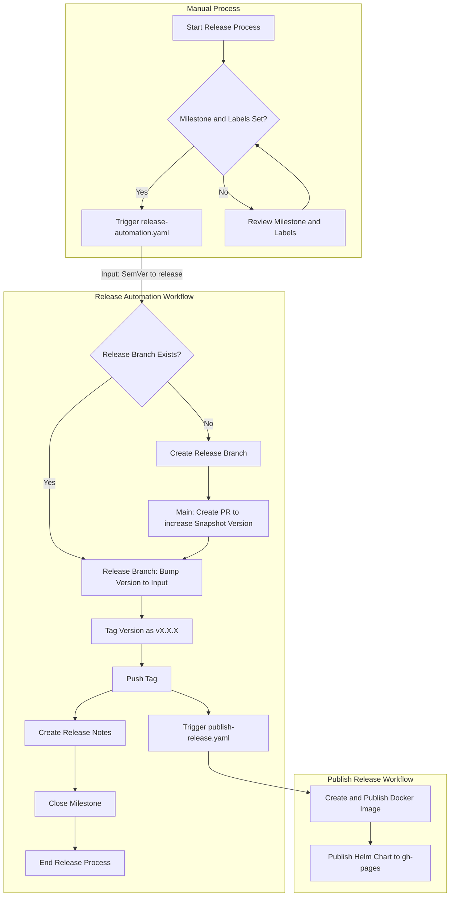
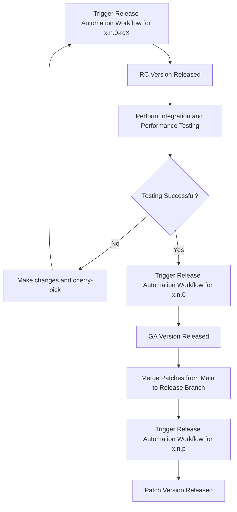

## Release Process Documentation

### Overview

This document outlines the release process for our project, detailing the steps involved in creating a new release, tagging, and publishing artifacts.

### Kickstart Release Process

1. **Milestone and Label Check**:
    - Ensure all Pull Requests (PRs) have a milestone set and appropriate labels. This is important for generating accurate release notes.
    - There is a CI check to ensure that all PRs have a milestone and labels set. If not, the PR will not be merged.
    - Make sure all PRs and Issues related to the related milestone are already closed, if not closed them before proceeding or move them to the next milestone.
2. **Trigger Release Automation Workflow**:
    - Manually trigger the `release-automation.yaml` workflow with the desired version to be released.
    - The workflow will create a new release branch, bump the version, and tag the release.
    - The release branch will be used for any patch versions or hot-fixes.
    - If the release branch already exists, the workflow should be triggered using the branch release, and the version should be bumped accordingly.
      - for example: if `release/0.1` exists, and you want to release `0.1.1`, trigger the workflow with `0.1.1` as the semver input and select `release/0.1` on "Use workflow from" dropdown.

### Release Automation Workflow

The release process is automated using a GitHub Actions workflow (`release-automation.yaml`). The workflow must be triggered manually with a SemVer version input, which specifies the version to be released. The input can be:
- `x.n.0-rc1` for release candidates
- `x.n.0` for general availability (GA) versions
- `x.n.p` for patch versions, including hot-fixes

#### Steps:

1. **Create or Update Release Branch**:
    - Create a new release branch `release/0.n` if it doesn't exist.
    - If the release branch was created, means it's a new release, create a PR on the main branch to increase the snapshot version to the next version.
    - Bump the version to the input provided in the release branch.

2. **Tagging**:
    - After bumping the version on the release branch, tag the version as `vX.n.p` (where `X.n.p` is the input).
    - Push the tag, triggering the `Publish Release Workflow`.

3. **Release Notes and Milestone**:
    - Create release notes for the new Tag.
    - Close the milestone associated with the release.
    - Upload distribution artifacts to the release.
    - Publish the artifacts to Sonatype Nexus / Maven Central.

### Publish Release Workflow

The `Publish Release Workflow` (`publish-release.yaml`) is triggered by the Tag pushed in the previous step. This workflow performs the following tasks:

1. **Docker Image Creation and Publishing**:
    - Create a Docker image with the new release version and publish it to the GitHub Container Registry (`ghcr.io`).

2. **Helm Chart Publishing**:
    - Publish a new Helm chart with the same version to the custom GitHub Pages of the repo in the `Charts` folder.

### Mermaid Diagram

### Release Meta Process

The meta process typically follows these steps:

1. **Initial Release Candidate (RC)**:
    - Trigger the Release Automation Workflow with an `rc` version (e.g., `x.n.0-rcY`).
    - Perform integration and performance testing on this version.

2. **General Availability (GA)**:
    - Once testing is successful, trigger the Release Automation Workflow again for the same version but as a GA version (e.g., `x.n.0`).

3. **Patch Versions**:
    - For any patch versions, changes will be merged (cherry-picked from main) into the release branch.
    - Start a new release automation process for the patch version (e.g., `x.n.p`).

## Conclusion

This release process ensures that all steps are automated, from checking PR milestones and labels to creating branches, tagging releases, and publishing Docker images and Helm charts. By following this documentation, you can streamline the release workflow and maintain consistency across all releases.

