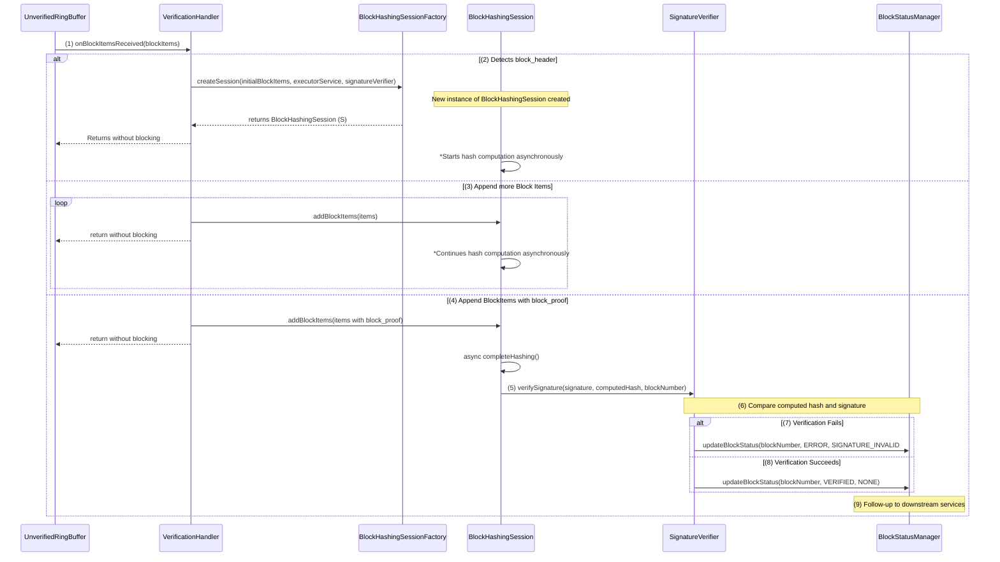

# Block Verification Design

## Table of Contents

1. [Purpose](#purpose)
2. [Goals](#goals)
3. [Terms](#terms)
4. [Entities](#entities)
5. [Design](#design)
6. [Enums](#enums)
7. [Metrics](#metrics)
8. [Exceptions](#exceptions)

## Purpose

The purpose of the Block Verification feature is to ensure that blocks received
from consensus nodes are valid and have not been tampered with. This is achieved
by re-calculating the block hash and verifying it against the signature provided
by the consensus node.

## Goals

1. The block-node must re-create the block hash from the block items and verify
   that it matches the hash implied by the signature.
2. If verification fails, the block should be considered invalid, and
   appropriate error-handling procedures must be triggered.

## Terms

<dl>
<dt>Consensus Node (CN)</dt><dd>A node that produces and provides blocks.</dd>
<dt>Block Items</dt><dd>The block data pieces (header, events, transactions,
transaction result, state changes, proof) that make up a block.</dd>
<dt>Block Hash</dt><dd>A cryptographic hash representing the block’s integrity.</dd>
<dt>Signature</dt><dd>The cryptographic signature on the block hash, created by the
Network aggregation of "share" private keys, as described in the TSS design.</dd>
<dt>Public Key</dt><dd>The public key (a.k.a. Ledger ID) of the network that signed the block.</dd>
</dl>

## Entities

-

### VerificationHandler

- Receives the stream of block items from the unverified block items ring
  buffer.
- When it detects a block_header, it creates a BlockHashingSession using the
  BlockHashingSessionFactory, providing it with the initial block items (and
  internally, the session will handle asynchronous hashing).
- Adds subsequent block items to the session, including the block_proof.
- Does not block waiting for verification; the hash computation and
  verification continue asynchronously.
  -

### BlockHashingSessionFactory

- Creates new BlockHashingSession instances, provides them with a
  ExecutorService.
  -

### BlockHashingSession

- Holds all necessary block data while it is waiting to hash it.
- Accepts block items incrementally. (continues to compute them
  asynchronously)
- Once the block_proof is provided, finalizes the hash computation
  asynchronously.
- After computing the final hash, calls SignatureVerifier for verification.
  -

### SignatureVerifier

- Verifies the block signature is valid (using the ledger ID) and signed the
  same hash that was computed by the `BlockHashingSession`.
- Report results to BlockStatusManager.
  -

### BlockStatusManager

- Receives verification results from SignatureVerifier.
- Updates block status and triggers any necessary recovery or follow-up
  processes depending on the outcome.

## Design

1. The `VerificationHandler` receives the block items from the unverified ring
   buffer.
2. When the block_header is detected, the `VerificationHandler` creates a
   `BlockHashingSession` using the `BlockHashingSessionFactory`.
3. The `BlockHashingSession` accepts subsequent block items incrementally.
4. Once the block_proof is received, the `BlockHashingSession` calls
   `completeHashing()` to finalize the hash computation.
5. Upon completion of computing the final block hash, the `BlockHashingSession`
   calls the `SignatureVerifier` to verify the signature.
6. The `SignatureVerifier` compares the computed hash to the hash signed by the
   Block Proof signature.
7. If the verification fails, the `SignatureVerifier` calls the
   `BlockStatusManager` to update the block status as SIGNATURE_INVALID.
8. If the verification succeeds, the `SignatureVerifier` calls the
   `BlockStatusManager` to update the block status as VERIFIED.
9. The `BlockStatusManager` initiates any necessary recovery or follow-up
   processes depending on the verification result.

Sequence Diagram:

## Configuration

As with other services already implemented in the Block Node system, the current
Block Verification Service should be able to be configurable via a Config Object
`VerificationConfig` and all the configurations needed shall be defined in
there.

Specifics on the properties names and possible values will be defined at the
Configuration document, but should include a way to enable/disable the module,
select Hashing algorithm and the amount of concurrent workers for the
`ServiceExecutor` pool.

## Metrics

<dl>
<dt>blocks_received</dt><dd>Counter of the number of blocks received for
verification.</dd>
<dt>blocks_verified</dt><dd>Counter of the number of blocks verified.</dd>
<dt>blocks_unverified</dt><dd>Counter of the number of blocks that have not been
verified, is the difference between blocks_received and blocks_verified.</dd>
<dt>blocks_signature_invalid</dt><dd>Counter of the number of blocks with
invalid signatures.</dd>
<dt>blocks_system_error</dt><dd>Counter of the number of blocks with system
errors.</dd>
<dt>block_verification_time</dt><dd>Histogram of the time taken to verify a
block, gives the node operator an idea of the time taken to verify a block.</dd>
</dl>

## Exceptions

- **SYSTEM_ERROR:** Issues with node configuration or bugs. The node logs
  details, updates metrics, and might attempt recovery or halt.
- **SIGNATURE_INVALID:** If verification fails, SIGNATURE_INVALID is used. The
  block is marked invalid, and the BlockStatusManager triggers error-handling
  routines (requesting re-sends, removing corrupted data, notifying subscribers,
  etc.).

### Signature invalid

If the computed hash does not match the hash signed by the network, the block is
considered unverified. It is marked as such and publishers are requested to
resend the block.
