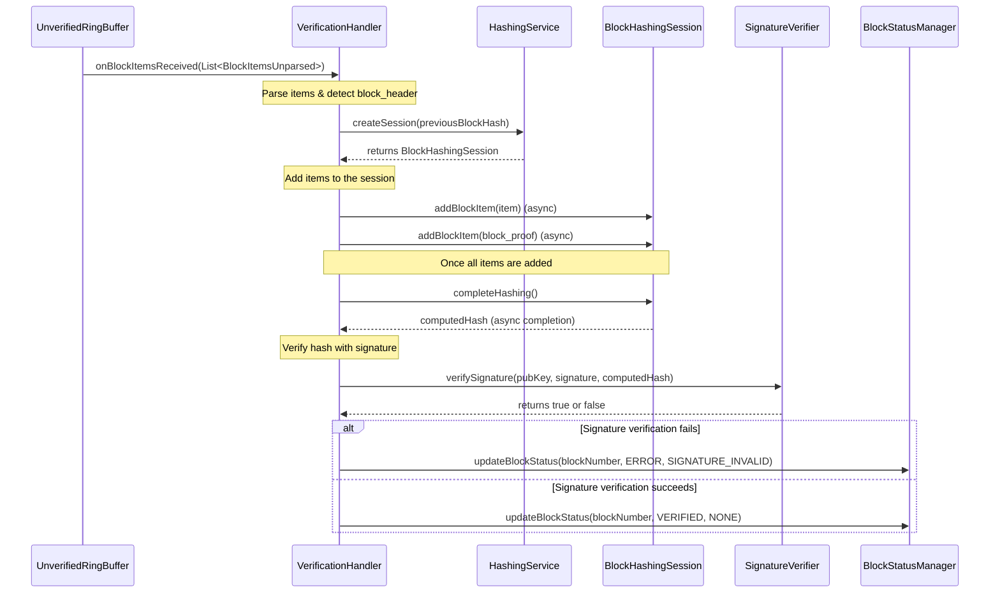

# Block Verification

## Table of Contents

1. [Purpose](#purpose)
2. [Goals](#goals)
3. [Terms](#terms)
4. [Entities](#entities)
5. [Design](#design)
6. [Interfaces](#interfaces)
7. [Enums](#enums)
8. [Metrics](#metrics)
9. [Exceptions](#exceptions)

## Purpose

The objective of the Block Verification feature of the block-node is to ensure that blocks received from consensus nodes are valid and have not been tampered with. This is done by re-calculating the block’s hash from its items and verifying that it matches the hash implied by the signature. If the computed hash does not match, the block is considered invalid.

## Goals

1) The block-node must re-create the block hash from its items and verify that it matches the expected hash derived from the block’s signature.
2) If verification fails, the block should be marked as invalid and appropriate error handling should be triggered.


## Terms

- Consensus Node (CN): A node that produces and provides blocks.
- Block Items: The block data pieces (header, events, transactions, transaction result, state changes, proof) that make up a block.
- Block Hash: A cryptographic hash representing the block’s integrity.
- Signature: The cryptographic signature of the block hash created by Network private key (aka: LedgerId)
- Public Key: The public key of the LedgerId that signed the block.


## Entities

- **VerificationHandler** 
  - Receives the stream of block items in the form of List<BlockItemsUnparsed> from the unparsed and unverified block items ring buffer. 
  - Parses the block items, creates a new block context, and obtains a `BlockHashingSession` from the `BlockHashingSessionFactory`.
  - Feeds all the block items to the `BlockHashingSession`.
  - Once hashing is completed, verifies the signature. if verification fails, marks the block as invalid, else marks it as verified.
- **BlockHashingSessionFactory**
  - Responsible for creating instances of BlockHashingSession for computing block hashes.
- **BlockHashingSession**
  - Incrementally accepts block items and computes the final block hash asynchronously once completes as soon as all required items are provided (block proof is the last needed item)
  - Returns the computed hash upon completion.
- **SignatureVerifier**
  - Verifies the signature by comparing the computed hash to the hash implied by the signature (using the public key).
  - Returns true if valid, false otherwise.
- **BlockStatusManager**
  - Tracks the verification status of blocks. (also tracks persistence and other block statuses)
  - Updates the block status based on the verification results.
  - Handles downstream processes in case of invalid or valid verification results.

## Design

`VerificationHandler` receives block items from the unverified ring buffer. When it detects a block_header, it creates a `BlockHashingSession` using the `BlockHashingSessionFactory`. As subsequent items arrive, each is added to the `BlockHashingSession`.

Once all required items, including `block_proof`, are added, the session completes the hashing. The `VerificationHandler` then verifies the signature. If verification fails, a `SIGNATURE_INVALID` error is reported. If it succeeds, the block is verified.

Sequence Diagram:


## Interfaces

### VerificationHandler

```java
public interface VerificationHandler {
    void onBlockItemsReceived(List<BlockItemsUnparsed> blockItems);
    void onBlockHashComputed(BlockContext context, byte[] computedHash);
    void onVerificationResult(BlockContext context, boolean isValid, VerificationError error);
}
```
### BlockHashingSessionFactory
```java
public interface BlockHashingSessionFactory {
    BlockHashingSession createSession(byte[] previousBlockHash);
}
```
### BlockHashingSession
```java
public interface BlockHashingSession {
    void addBlockItem(BlockItem item);
    CompletableFuture<byte[]> completeHashing();
}
```
### SignatureVerifier
```java

public interface SignatureVerifier {
    boolean verifySignature(byte[] publicKey, byte[] signature, byte[] computedHash);
}
```
### BlockStatusManager
```java

public interface BlockStatusManager {
    void updateBlockStatus(byte[] blockId, BlockVerificationStatus status, VerificationError error);
}
```

## Enums
```java
public enum BlockVerificationStatus {
    UNVERIFIED,
    VERIFIED,
    SIGNATURE_INVALID,
    SYSTEM_ERROR
}
```

## Metrics

- **blocks_unverified**: Gauge of the number of blocks pending verification
- **blocks_verified**: Counter of the number of blocks verified
- **blocks_signature_invalid**: Counter of the number of blocks with invalid signatures
- **blocks_system_error**: Counter of the number of blocks with system errors
- **block_verification_time**: Histogram of the time taken to verify a block 
- 
## Exceptions

- **SYSTEM_ERROR:** Issues with node configuration or bugs. The node logs details, updates metrics, and might attempt recovery or halt.

- **SIGNATURE_INVALID:** If verification fails, SIGNATURE_INVALID is used. The block is marked invalid, and the BlockStatusManager triggers error-handling routines (requesting re-sends, removing corrupted data, notifying subscribers, etc.).

### Signature invalid
If the computed hash does not match the hash implied by the signature, the block is considered tampered. It is marked invalid and appropriate recovery steps are taken.


