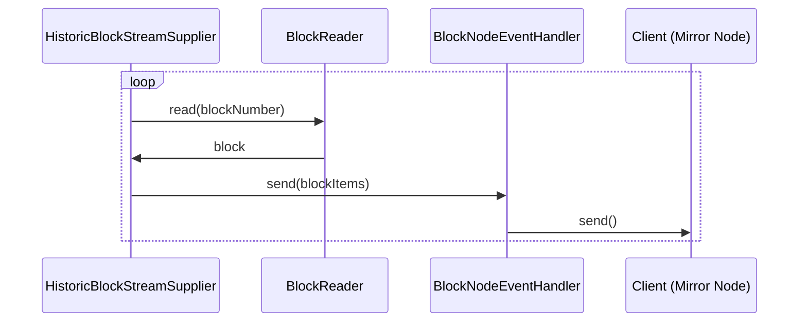

# Closed-Range Historic Block Streaming Design

## Table of Contents

1. [Purpose](#purpose)
2. [Goals](#goals)
3. [Terms](#terms)
4. [Entities](#entities)
5. [Design](#design)
6. [Sequence Diagram](#sequence-diagram)
7. [Configuration](#configuration)
8. [Metrics](#metrics)
9. [Exceptions](#exceptions)
10. [Acceptance Tests](#acceptance-tests)

## Purpose

The purpose of the Closed-Range Historic Block Streaming feature is to provide a mechanism for
consumers to request a discrete, closed-range stream of historic blocks from the `subscribeBlockStream` rpc
endpoint via the `SubscribeStreamRequest` message. This is a distinct feature from a `starting_block_number` and an
`end_block_number` of zero indicating an infinite stream of blocks (transition to live blocks).

See the `block_service.proto` file definition [here](https://github.com/hashgraph/hedera-protobufs/blob/c0ca3524f2e80e5d5e545e36fcb5d23d64c31fb5/block/block_service.proto#L531-L562).

## Goals

1. Provide a closed-range stream of historic block items to a downstream observer.

## Terms

See the range specification in the  `block_service.proto` file definition [here](https://github.com/hashgraph/hedera-protobufs/blob/c0ca3524f2e80e5d5e545e36fcb5d23d64c31fb5/block/block_service.proto#L531-L562).
`SubscribeStreamResponse` definition [here](https://github.com/hashgraph/hedera-protobufs/blob/c0ca3524f2e80e5d5e545e36fcb5d23d64c31fb5/block/block_service.proto#L582-L622)

## Entities

### BlockReader

- An entity which is responsible for reading block items from the persistence service.

### HistoricBlockStreamSupplier

- An entity which is responsible for supplying historic block items to a BlockNodeEventHandler.

### BlockNodeEventHandler

- An entity which manages a connection to a streaming client provided by Helidon and which receives data from an
  HistoricBlockStreamSupplier. It is responsible for sending the data to the streaming client.

### PbjBlockStreamServiceProxy

- An entity which is responsible for reading the gRPC `SubscribeStreamRequest` message, validating the
  `start_block_number` and `end_block_number` and building/injecting all other necessary entities to
  stream the historic blocks back to the client.

## Design

1. The `PbjBlockStreamServiceProxy` is called by Helidon when a client makes a request to the `subscribeBlockStream` rpc
   endpoint. After validating the `start_block_number` and `end_block_number`, it creates an `HistoricBlockStreamSupplier`
   with the requested block range, a `BlockReader`, a `BlockNodeEventHandler` and an `ExecutorService`.
2. `HistoricBlockStreamSupplier` reads the blocks from the `BlockReader` and sends them to the client via the
   `BlockNodeEventHandler`.
3. Once all the blocks in the requested range have been sent, the `BlockNodeEventHandler` will send a
   `READ_STREAM_SUCCESS` SubscribeStreamResponseCode to the client.

## Sequence Diagram

## Configuration

This feature will leverage one of our standard Config objects to communicate properties.
- `maxBlockItemBatchSize` - An integer used to determine the max size of each block item batch a block from the BlockReader
is broken up into before being sent to a client.

## Metrics

<dl>
<dt>HistoricBlockItemsConsumed</dt><dd>Counter for the number of historic block items consumed by each BlockNodeEventHandler</dd>
<dt>HistoricBlockStreamError</dt><dd>Counter for the number of errors encountered by an HistoricBlockStreamSupplier</dd>
</dl>

## Exceptions

Based on the `SubscribeStreamRequest` specification, the following error response messages may be returned to the client:

### READ_STREAM_INVALID_START_BLOCK_NUMBER

- The `start_block_number` is greater than the `end_block_number`.
- The `start_block_number` is invalid.

### READ_STREAM_INVALID_END_BLOCK_NUMBER

- The `end_block_number` is invalid.

### READ_STREAM_NOT_AVAILABLE

- Sent if the service is unavailable.

## Acceptance Tests

- Negative tests for the following:
  - `start_block_number` is greater than the `end_block_number`
  - `start_block_number` is invalid
  - `end_block_number` is invalid
  - Service unavailable
  - Mocked BlockReader and client object should verify that an error response is sent to the client.
- Positive tests using a mocked BlockReader and client object should verify that blocks found within the closed range
  are correctly streamed to the client and that a `READ_STREAM_SUCCESS` response is sent to complete the stream.
