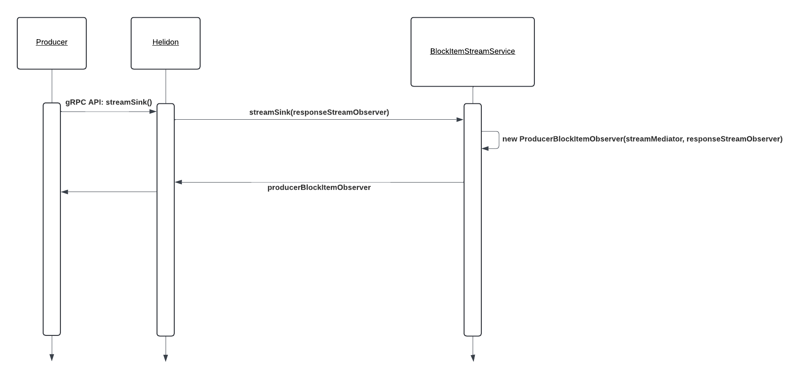
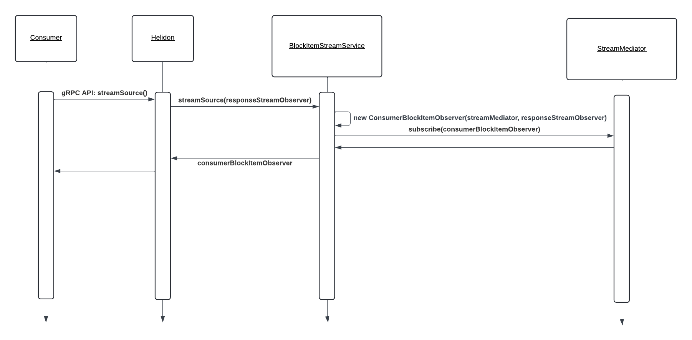
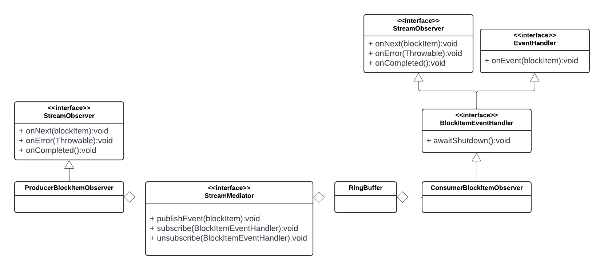
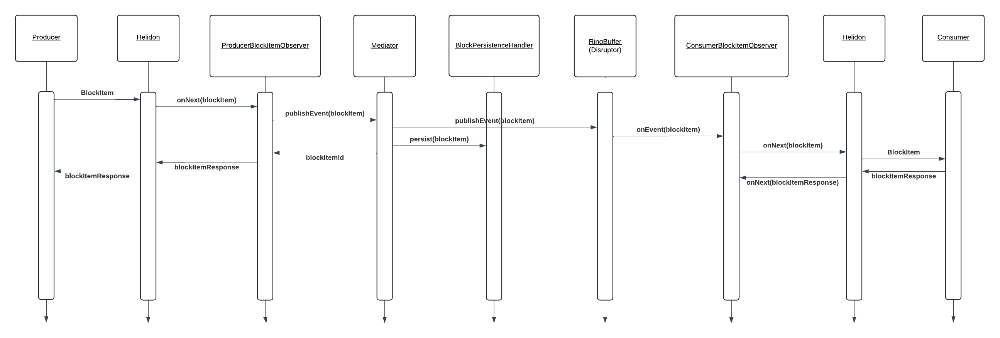

# Bi-directional Producer/Consumer Streaming with gRPC

## Table of Contents

1. [Purpose](#purpose)
2. [Goals](#goals)
3. [Terms](#terms)
4. [Block Node gRPC Streaming Services API](#block-node-grpc-streaming-services-api)
5. [Approaches](#approaches)
   1. [Approach 1: Directly passing BlockItems from `ProducerBlockItemObserver` to N `ConsumerBlockItemObserver`s](#approach-1-directly-passing-blockitems-from-producerblockitemobserver-to-n-consumerblockitemobservers)
   2. [Approach 2: Use a shared data structure between `ProducerBlockItemObserver` and `ConsumerBlockItemObserver`s. Consumers busy-wait for new BlockItems](#approach-2-use-a-shared-data-structure-between-producerblockitemobserver-and-consumerblockitemobservers-consumers-busy-wait-for-new-blockitems)
   3. [Approach 3: Use a shared data structure between `ProducerBlockItemObserver` and `ConsumerBlockItemObserver`s. Use downstream consumer BlockItemResponses to drive the process of sending new BlockItems](#approach-3-use-a-shared-data-structure-between-producerblockitemobserver-and-consumerblockitemobservers-use-downstream-consumer-blockitemresponses-to-drive-the-process-of-sending-new-blockitems)
   4. [Approach 4: Shared data structure between producer and consumer services. Leveraging the LMAX Disruptor library to manage inter-process pub/sub message-passing between producer and consumers via RingBuffer](#approach-4-shared-data-structure-between-producer-and-consumer-services-leveraging-the-lmax-disruptor-library-to-manage-inter-process-pubsub-message-passing-between-producer-and-consumers-via-ringbuffer)
6. [Design](#design)
   1. [Producer Registration Flow](#producer-registration-flow)
   2. [Consumer Registration Flow](#consumer-registration-flow)
   3. [Runtime Streaming](#runtime-streaming)
   4. [Entities](#entities)
7. [Diagrams](#diagrams)
   1. [Producer Registration Flow](#producer-registration-flow-1)
   2. [Consumer Registration Flow](#consumer-registration-flow-1)
   3. [Class Diagram of all Entities and their Relationships](#class-diagram-of-all-entities-and-their-relationships)
   4. [Runtime Stream of BlockItems from Producer to Consumers](#runtime-stream-of-blockitems-from-producer-to-consumers)

---

## Purpose

A primary use case of the `hiero-block-node` is to stream live BlockItems (see Terms section) from a producer
(e.g. Consensus Node) to N consumers (e.g. Mirror Node) with the lowest possible latency while correctly preserving the
order of the BlockItems. This document outlines several possible strategies to implement this use case and the design
of the recommended approach. All strategies rely on the Helidon 4.x.x server implementations of HTTP/2 and gRPC
services to ingest BlockItem data from a producer and then to stream the same BlockItems to downstream consumers. It
does this by defining bidirectional gRPC streaming services based on protobuf definitions.

Helidon provides well-defined APIs and extension points to implement business logic for these services. The main entry
point for custom logic is an implementation of `GrpcService`.

---

## Goals

1) Consumers must be able to dynamically subscribe and unsubscribe from the live stream of BlockItems emitted by the
producer.  When a consumer subscribes to the stream, they will begin receiving BlockItems at the start of the next Block.
BlockItems transiting before the start of the next Block will not be sent to that downstream consumer.
2) Correct, in-order streaming delivery of BlockItems from a producer to all registered consumers.
3) Minimize latency between the producer and consumers.
4) Minimize CPU resources consumed by the producer and consumers.

---

## Terms

**BlockItem** - The BlockItem is the primary data structure passed between the producer, the `hiero-block-node`
and consumers. A defined sequence of BlockItems represent a Block when stored on the `hiero-block-node`.

**Bidirectional Streaming** - Bidirectional streaming is an [HTTP/2 feature](https://datatracker.ietf.org/doc/html/rfc9113#name-streams-and-multiplexing)
allowing both a client and a server emit a continuous stream of frames without waiting for responses. In this way, gRPC
services can be used to efficiently transmit a continuous flow of BlockItem messages while the HTTP/2 connection is open.

**Producer StreamObserver** - The Producer StreamObserver is a custom implementation of the [gRPC StreamObserver
interface](https://github.com/grpc/grpc-java/blob/0ff3f8e4ac4c265e91b4a0379a32cf25a0a2b2f7/stub/src/main/java/io/grpc/stub/StreamObserver.java#L45) used by Helidon. It is initialized by the BlockItemStreamService (see Entities section). Helidon invokes
the Producer StreamObserver at runtime when the producer sends a new BlockItem to the `publishBlockStream` gRPC service.

**Consumer StreamObserver** - The Consumer StreamObserver is a custom implementation of the [gRPC StreamObserver
interface](https://github.com/grpc/grpc-java/blob/0ff3f8e4ac4c265e91b4a0379a32cf25a0a2b2f7/stub/src/main/java/io/grpc/stub/StreamObserver.java#L45) used by Helidon. It is initialized by the BlockItemStreamService (see Entities section). Helidon invokes
the Consumer StreamObserver at runtime when the downstream consumer of the `subscribeBlockStream` gRPC service sends HTTP/2
responses to sent BlockItems.

**subscribe** - Consumers calling the `subscribeBlockStream` gRPC service must be affiliated or subscribed with a producer to
receive a live stream of BlockItems from the `hiero-block-node`.

**unsubscribe** - Consumers terminating their connection with the `subscribeBlockStream` gRPC service must be unaffiliated or
unsubscribed from a producer so that internal objects can be cleaned up and resources released.

---

## Block Node gRPC Streaming Services API

The Block Node gRPC Streaming Services API is now aligned with the names and simplified types defined in the
[`hedera-protobufs` repository on the `continue-block-node` branch](https://github.com/hashgraph/hedera-protobufs/blob/25783427575ded59d06d6bf1ed253fd24ef3c437/block/block_service.proto#L701-L742).

---

## Approaches:

All the following approaches require integrating with Helidon 4.x.x gRPC services to implement the bidirectional
streaming API methods defined above. The following objects are used in all approaches:

`BlockItemStreamService` is a custom implementation of the Helidon gRPC `GrpcService`. It is responsible for binding
the Helidon routing mechanism to the gRPC streaming methods called by producers and consumers.

`ProducerBlockItemObserver` is a custom implementation of the Helidon gRPC `StreamObserver` interface.
`BlockItemStreamService` instantiates a new `ProducerBlockItemObserver` instance when the `publishBlockStream` gRPC method is
called by a producer. Thereafter, Helidon invokes `ProducerBlockItemObserver` methods to receive the latest BlockItem
from the producer and return BlockItemResponses via a bidirectional stream.

`ConsumerBlockItemObserver` is also a custom implementation of the Helidon gRPC `StreamObserver` interface.
`BlockItemStreamService` instantiates a new `ConsumerBlockItemObserver` instance when the `subscribeBlockStream` gRPC method
is called by each consumer. The `ConsumerBlockItemObserver` wraps an instance of `StreamObserver` provided by Helidon
when the connection is established. The `ConsumerBlockItemObserver` uses the `StreamObserver` to send the latest
BlockItem to the downstream consumer. Helidon invokes `ConsumerBlockItemObserver` methods to deliver BlockItemResponses
from the consumer in receipt of BlockItems.

### Approach 1: Directly passing BlockItems from `ProducerBlockItemObserver` to N `ConsumerBlockItemObserver`s.

Directly passing BlockItems from the `ProducerBlockItemObserver` to N `ConsumerBlockItemObserver`s without storing
BlockItems in an intermediate data structure. This approach was the basis for one of the first implementations of gRPC
Live Streaming (see [BlockNode Issue 21](https://github.com/hiero-ledger/hiero-block-node/issues/21)). Unfortunately, this approach has the following problems:

Drawbacks:
1) Each `ProducerBlockItemObserver` must iterate over the list of subscribed consumers to pass the BlockItem to each
`ConsumerBlockItemObserver` before saving the BlockItem to disk and issuing a BlockItemResponse back to the producer.
The linear scaling of consumers will aggregate latency resulting in the last consumer in the list to be penalized
with the sum of the latencies of all consumers before it.
2) Dynamically subscribing/unsubscribing `ConsumerBlockItemObserver`s while deterministically broadcasting BlockItems
to each consumer in the correct order complicates and slows down the process. It requires thread-safe data
structures and synchronization on all reads and writes to ensure new/removed subscribers do not disrupt the
iteration order of the `ConsumerBlockItemObserver`s.

### Approach 2: Use a shared data structure between `ProducerBlockItemObserver` and `ConsumerBlockItemObserver`s. Consumers busy-wait for new BlockItems.

Alternatively, if `ProducerBlockItemObserver`s store BlockItems in a shared data structure before immediately returning
a response to the producer, the BlockItem is then immediately available for all `ConsumerBlockItemObserver`s to read
asynchronously. Consumers can repeatedly poll the shared data structure for new BlockItems. This approach has the
following consequences:

Advantages:
1) The `ProducerBlockItemObserver` can immediately return a BlockItemResponse to the producer without waiting for the
`ConsumerBlockItemObserver`s to process the BlockItem or waiting for the BlockItem to be written to disk.
2) No additional third-party libraries are required to implement this approach.

Drawbacks:
1) Busy-waiting consumers will increase CPU demand while polling the shared data structure for new BlockItems.
2) It is difficult to anticipate and tune an optimal polling interval for consumers as the number of consumers scales
up or down.
3) While prototyping this approach, it appeared that `ConsumerBlockItemObserver`s using a busy-wait to watch for new
BlockItems impaired the ability of the Helidon Virtual Thread instance to process the inbound responses from the
downstream consumer in a timely way. The aggressive behavior of the busy-wait could complicate future use cases
requiring downstream consumer response processing.

### Approach 3: Use a shared data structure between `ProducerBlockItemObserver` and `ConsumerBlockItemObserver`s. Use downstream consumer BlockItemResponses to drive the process of sending new BlockItems.

With this approach, the `ProducerBlockItemObserver` will store BlockItems in a shared data structure before immediately
returning a BlockItemResponse to the producer. However, rather than using a busy-wait to poll for new BlockItems,
`ConsumerBlockItemObserver`s will send new BlockItems only upon receipt of BlockItemResponses from previously sent
BlockItems. When Helidon invokes `onNext()` with a BlockItemResponse, the `ConsumerBlockItemObserver` (using an
internal counter) will calculate and send all newest BlockItems available from the shared data structure to the
downstream consumer. In this way, the downstream consumer responses will drive the process of sending new BlockItems.

Advantages:
1) It will not consume CPU resources polling.
2) It will not hijack the thread from responding to the downstream consumer. Rather, it uses the interaction with the
consumer to trigger sending the newest BlockItems downstream.
3) The shared data structure will need to be concurrent but, after the initial write operation, all subsequent reads
should not require synchronization.
4) The shared data structure will decouple the `ProducerBlockItemObserver` from the `ConsumerBlockItemObserver`s
allowing them to operate independently and not accrue the same latency issues as Approach #1.
5) No additional third-party libraries are required to implement this approach.

Drawbacks:
1) With this approach, BlockItems sent to the consumer are driven exclusively by the downstream consumer
BlockItemResponses. Given, the latency of a network request/response round-trip, this approach will likely be far
too slow to be considered effective even when sending a batch of all the latest BlockItems.

### Approach 4: Shared data structure between producer and consumer services. Leveraging the LMAX Disruptor library to manage inter-process pub/sub message-passing between producer and consumers via RingBuffer.

The LMAX Disruptor library is a high-performance inter-process pub/sub message passing library that could be used to
efficiently pass BlockItems between a `ProducerBlockItemObserver` and `ConsumerBlockItemObserver`s. The Disruptor
library is designed to minimize latency as well as CPU cycles to by not blocking while maintaining concurrency
guarantees.

Advantages:
1) The Disruptor library is designed to minimize the latency of passing BlockItem messages between a
`ProducerBlockItemObserver` and `ConsumerBlockItemObserver`s.
2) The Disruptor library is designed to minimize the CPU resources used by the `ProducerBlockItemObserver` and
`ConsumerBlockItemObserver`s.
3) The Disruptor library does not require any additional transient dependencies.
4) Fixes to the Disruptor library are actively maintained and updated by the LMAX team.

Drawbacks:
1) The Disruptor library is a third-party library requiring ramp-up time and integration effort to use it correctly and
effectively.
2) Leveraging the Disruptor library requires the communication between the `ProducerBlockItemObserver` and
`ConsumerBlockItemObserver`s to be affiliated by subscribing/unsubscribing the downstream consumers to receive the
latest BlockItems from the producer via the Disruptor RingBuffer. The process of managing these subscriptions to
the RingBuffer can be complex.

---

## Design

Given the goals and the proposed approaches, Approach #4 has significant advantages and fewer significant drawbacks.
Using the LMAX Disruptor offers low latency and CPU consumption via a well-maintained and tested API. The RingBuffer
intermediate data structure should serve to decouple the producer bidirectional stream from the consumer bidirectional
streams. Please see the following Entities section and Diagrams for a visual representation of the design.

### Producer Registration Flow

At boot time, the `BlockItemStreamService` will initialize the `StreamMediator` with the LMAX Disruptor RingBuffer.

When a producer calls the `publishBlockStream` gRPC method, the `BlockItemStreamService` will create a new
`ProducerBlockItemObserver` instance for Helidon to invoke during the lifecycle of the bidirectional connection to the
upstream producer. The `ProducerBlockItemObserver` is constructed with a reference to the `StreamMediator` and to
the `ResponseStreamObserver` managed by Helidon for transmitting BlockItemResponses to the producer.
See the Producer Registration Flow diagram for more details.

### Consumer Registration Flow

When a consumer calls the `subscribeBlockStream` gRPC method, the `BlockItemStreamService` will create a new
`ConsumerBlockItemObserver` instance for Helidon to invoke during the lifecycle of the bidirectional connection to the
downstream consumer. The `ConsumerBlockItemObserver` is constructed with a reference to the `StreamMediator` and to
the `ResponseStreamObserver` managed by Helidon for transmitting BlockItemResponses to the downstream consumer. The
`BlockItemStreamService` will also subscribe the `ConsumerBlockItemObserver` to the `StreamMediator` to receive the
streaming BlockItems from the producer.

### Runtime Streaming

At runtime, the `ProducerBlockItemObserver` will receive the latest BlockItem from the producer via Helidon and will
invoke publishEvent(BlockItem) on the `StreamMediator` to write the BlockItem to the RingBuffer. The
`ProducerBlockItemObserver` will then persist the BlockItem and return a BlockItemResponse to the producer via
its reference to `ResponseStreamObserver`.

Asynchronously, the RingBuffer will invoke the onEvent(BlockItem) method of all the subscribed
`ConsumerBlockItemObserver`s passing them the latest BlockItem. The `ConsumerBlockItemObserver` will then transmit
the BlockItem downstream to the consumer via its reference to the `ResponseStreamObserver`. Downstream consumers will
respond with a BlockItemResponse. Helidon will call the onNext() method of the `ConsumerBlockItemObserver` with the
BlockItemResponse.

BlockItems sent to the `ConsumerBlockItemObserver` via the RingBuffer and BlockItemResponses passed by Helidon from
the downstream consumer are used to refresh internal timeouts maintained by the `ConsumerBlockItemObserver`. If a
configurable timeout threshold is exceeded, the `ConsumerBlockItemObserver` will unsubscribe itself from the
`StreamMediator`. This mechanism is necessary because producers and consumers may not send HTTP/2 `End Stream` DATA
frames to terminate their bidirectional connection. Moreover, Helidon does not throw an exception back up to
`ConsumerBlockItemObserver` when the downstream consumer disconnects. Internal timeouts ensure objects are not
permanently subscribed to the `StreamMediator`.

### Entities

**BlockItemStreamService** - The BlockItemStreamService is a custom implementation of the Helidon gRPC GrpcService.
It is responsible for initializing the StreamMediator and instantiating ProducerBlockItemObserver and
ConsumerBlockItemObserver instances on-demand when the gRPC API is called by producers and consumers. It is
the primary binding between the Helidon routing mechanisms and the `hiero-block-node` custom business logic.

**StreamObserver** - StreamObserver is the main interface through which Helidon 4.x.x invokes custom business logic
to receive and transmit bidirectional BlockItem streams at runtime.

**ProducerBlockItemObserver** - A custom implementation of StreamObserver invoked by Helidon at runtime which is
responsible for:
1) Receiving the latest BlockItem from the producer (e.g. Consensus Node).
2) Returning a response to the producer.

**StreamMediator** - StreamMediator is an implementation of the [Mediator Pattern](https://en.wikipedia.org/wiki/Mediator_pattern)
encapsulating the communication and interaction between the producer (ProducerBlockItemObserver) and N consumers
(ConsumerBlockItemObserver) using the RingBuffer of the Disruptor library. It manages the 1-to-N relationship between
the producer and consumers.

**RingBuffer** - A shared data structure between the producer and consumers that temporarily stores inbound BlockItems.
The RingBuffer is a fixed-sized array of ConsumerBlockItemObservers that is managed by the Disruptor library.

**EventHandler** - The EventHandler is an integration interface provided by the Disruptor library as a mechanism to
invoke callback logic when a new BlockItem is written to the RingBuffer. The EventHandler is responsible for passing
the latest BlockItem to the ConsumerBlockItemObserver when it is available in the RingBuffer.

**ConsumerBlockItemObserver** - A custom implementation of StreamObserver called by Helidon which is responsible for:
1) Receiving the latest response from the downstream consumer.
2) Receiving the latest BlockItem from the RingBuffer.
3) Sending the latest BlockItem to the downstream consumer.

**BlockPersistenceHandler** - The BlockPersistenceHandler is responsible for writing the latest BlockItem to disk.

---

## Diagrams

### Producer Registration Flow

### Consumer Registration Flow

### Class Diagram of all Entities and their Relationships

### Runtime Stream of BlockItems from Producer to Consumers

---
