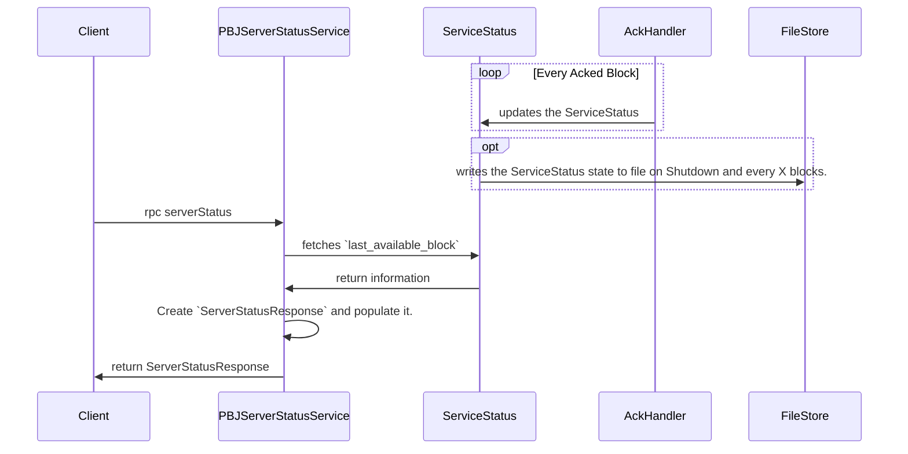

# ServerStatus API Design

## Table of Contents

1. [Purpose](#purpose)
2. [Goals](#goals)
3. [Terms](#terms)
4. [Entities](#entities)
5. [Design](#design)
6. [Sequence Diagram](#sequence-diagram)
7. [Configuration](#configuration)
8. [Metrics](#metrics)
9. [Exceptions](#exceptions)
10. [Acceptance Tests](#acceptance-tests)

## Purpose

**ServerStatus** API Component, is an essential part of the Block-Node, it provides a way to query the status of the server, its version and other relevant information.
More details on the API specification can be found on the [protobuf definition](https://github.com/hashgraph/hedera-protobufs/blob/main/block/block_service.proto#L874-L882).

## Goals

1. Provide a way to query the status information of the server. current response includes:
   2. first_available_block
   3. last_available_block
   4. only_latest_state
   5. version_information
2. Persist ServiceStatus to file and restore it on start-up.

## Terms

<dl>
<dt>Client</dt><dd>The consumer of the ServerStatus, it might be a Consensus Node, a Miror Node or another Block Node.</dd>
<dt>first_available_block</dt><dd>The first block that this Block Node has persisted and available to query and stream.</dd>
<dt>last_available_block</dt><dd>Last available block that this Block Node has persisted and is available to query and stream.</dd>
</dl>

## Entities

### PBJServerStatusService

PBJServerStatusService is the entity responsible for handling the server status requests. It provides the implementation for the `getServerStatus` rpc endpoint.

### ServiceStatus

Keeps the information of the Service status within the different components of the Block-Node.
This entity is vital (non-optional) for the Block-Node to function properly.

### AckHandler

It updates the ServiceStatus of the latest Acknowledged block.

## Design

### ServiceStatus

1. ServiceStatus will store the relevant information to file, will update file every X blocks and on Shutdown hook.
2. At start-up, the ServiceStatus upon creation, will attempt to restore it state from the file (if available).
3. The ServiceStatus will be updated by the AckHandler, when a new block is Acknowledged.

### ServerStatusRequest

1. The PBJServerStatusService is called by Helidon when a client makes a request to the `serverStatus` rpc endpoint. using `ServerStatusRequest` message.
2. The PBJServerStatusService reads the server status information from the ServiceStatus entity and sends it back to the client via a `ServerStatusResponse` message.

## Sequence Diagram



### Response Payload Example

Showing the information that is currently available in the ServerStatusResponse:

```json
{
  "first_available_block": 0,
  "last_available_block": 100,
  "only_latest_state": false,
  "version_information": {
    "address_book_version": "0.1.0",
    "stream_proto_version": "0.1.0",
     "software_version": "0.4.0"
  }
}
```

## Configuration

ServerStatus Configuration will hold the expected `first_desired_block` that the BN should start from, as part of the start-up process a BN should check using the BlockReader, if that Block is available on Disk, if not, should attempt to fetch it from another BN unless is Genesis block, by default it will be set to 0 (Genesis Block), if not possible to fetch it from another BN, it should throw an exception and stop the service.

Configuration should also provide value for `only_latest_state`, this might be part of the configuration for the state module.

## Metrics

ServerStatusRequest Counter, to keep track of the number of requests made to the ServerStatus endpoint.

## Exceptions

The PBJServerStatusService should handle any exceptions that might occur during the process of fetching the server status information, and return an appropriate error message to the client.

## Acceptance Tests

1. Verify that ServiceStatus writes latest `last_available_block` to file.
2. Verify that ServiceStatus onStartup reads the latest `last_available_block` from file.
3. Verify that PBJServerStatusService returns the correct information.
4. Verify that the ServerStatusRequest Counter is incremented on each request.
5. Verify that the PBJServerStatusService handles exceptions correctly.
