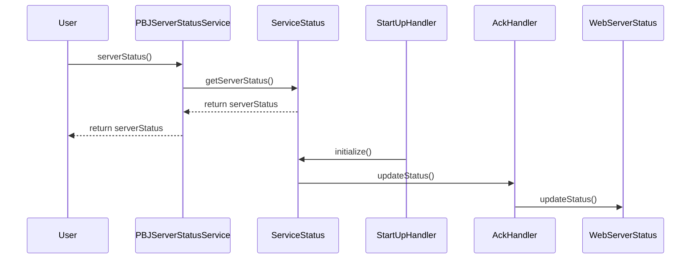

# Design Document Template

## Table of Contents

1. [Purpose](#purpose)
2. [Goals](#goals)
3. [Terms](#terms)
4. [Entities](#entities)
5. [Design](#design)
6. [Sequence Diagram](#sequence-diagram)
7. [Configuration](#configuration)
8. [Metrics](#metrics)
9. [Exceptions](#exceptions)
10. [Acceptance Tests](#acceptance-tests)

## Purpose
Server Status API Component, is an essential part of the Block-Node, it provides a way to query the status of the server, its version and other relevant information.
More details on the specification can be found on the [protobuf service](https://github.com/hashgraph/hedera-protobufs/blob/main/block/block_service.proto#L874-L882). 

## Goals

1. Provide a way to query the status information of the server.
   2. first_available_block
   3. last_available_block
   4. only_latest_state
   5. version_information
2. Provide a way for the BN to remember its status between restarts and upgrades.

## Terms

## Entities

### PBJServerStatusService
PBJServerStatusService is the entity responsible for handling the server status requests. It provides the implementation for the `getServerStatus` rpc endpoint.

### ServiceStatus
Keeps the information of the Service status, such as the first available block, last available block, only latest state, and version information, among others that might be needed by other components.
This entity is vital (non-optional) for the Block-Node to function properly.

### WebServerStatus

### AckHandler
It updates the ServiceStatus of the latest Acknowledged block.

### StartUpHandler
This entity is responsible for initializing the server status information when the Block-Node starts up. It fetches the needed information using configuration properties and other components.

## Design

1. At Start-up the StartUpHandler initializes the ServiceStatus entity with the first_available_block and last_available_block. 
2. The PBJServerStatusService is called by Helidon when a client makes a request to the `serverStatus` rpc endpoint. using `ServerStatusRequest` message.
3. The PBJServerStatusService reads the server status information from the ServiceStatus entity and sends it back to the client via a `ServerStatusResponse` message.

## Sequence Diagram

### Consider using mermaid to generate the sequence diagram

## Configuration

## Metrics

## Exceptions

## Acceptance Tests
